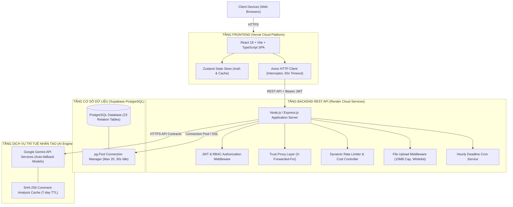
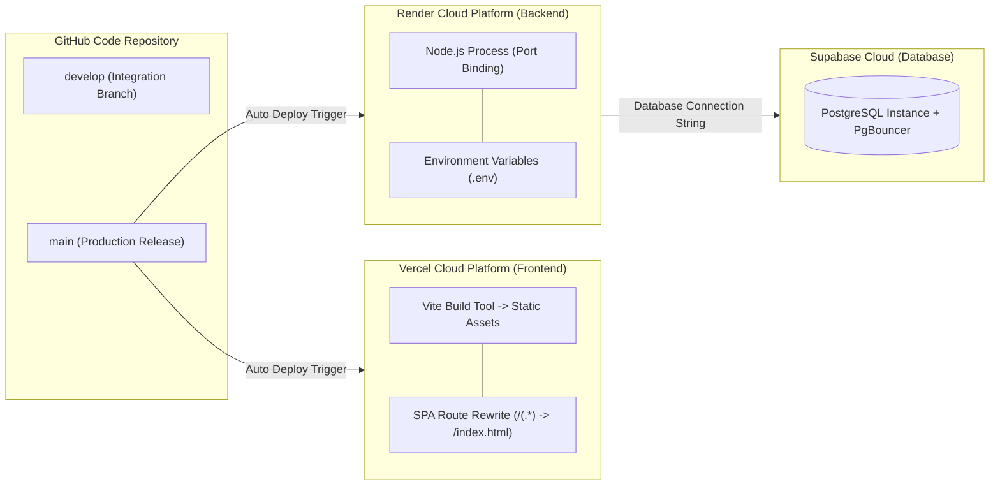

# 📘 10. KIẾN TRÚC HỆ THỐNG VÀ PHƯƠNG ÁN TRIỂN KHAI

Tài liệu này trình bày toàn bộ thiết kế kiến trúc hệ thống, kiến trúc kỹ thuật chi tiết các tầng, quy trình luồng dữ liệu, chính sách bảo mật ẩn danh (Double-Blind), cơ chế tự vệ hệ thống và phương án triển khai thực tế trên hạ tầng đám mây (Cloud Deployment) cho hệ thống **PeerReview-AI**.

---

## 10.1. TỔNG QUAN KIẾN TRÚC HỆ THỐNG

Hệ thống **PeerReview-AI** được thiết kế theo kiến trúc Client-Server hiện đại, phân tách thành **4 tầng độc lập (4-Tier Architecture)** nhằm đảm bảo tính mở rộng, khả năng bảo trì và khả năng chịu tải cho quy mô 500 – 1.000 người dùng trong các đợt chấm chéo cao điểm.



### Các User Roles chính trong Kiến trúc:
1. **`STUDENT` (Sinh viên):** Tham gia nhóm làm việc, thực hiện công việc trong Group Workspace, nộp tệp bài làm (Submit Assignment), thực hiện chấm chéo ẩn danh (Double-Blind Peer Review) và nhận gợi ý từ AI Peer-Review Mentor.
2. **`TEACHER` (Giảng viên):** Quản lý Lớp học, tạo Bài tập & Rubric tiêu chí chấm, kích hoạt Thuật toán Phân công chấm chéo tự động, duyệt kết quả tổng hợp AI Review Synthesis, xem báo cáo Contribution Analytics & Cảnh báo sớm Collaboration Risk.
3. **`ADMIN` (Quản trị viên):** Quản lý người dùng, phân quyền Role, giám sát Audit Logs hệ thống, cấu hình tham số vận hành động (`system_config`) và theo dõi Dashboard tổng quan.

---

## 10.2. KIẾN TRÚC KỸ THUẬT CHI TIẾT THEO TẦNG

### 1. Tầng Frontend (Client Layer)
- **Công nghệ cốt lõi:** React 18, Vite, TypeScript, React Router v6.
- **State Management:** `Zustand` (với middleware `persist` lưu trữ `user` và `token` an toàn vào `localStorage`).
- **Data Fetching & Cache:** `@tanstack/react-query` giúp quản lý server state, tự động hủy request cũ và dọn dẹp cache (`queryClient.clear()`) khi người dùng đăng xuất.
- **HTTP Transport Layer ([axios.ts](file:///d:/Sang_Tao_AI/PeerReview-AI/frontend/src/lib/axios.ts)):**
  - **Dynamic Base URL:** Hàm `getBaseUrl()` tự động đọc biến môi trường `VITE_API_URL` (chuẩn hóa hậu tố `/api`).
  - **Request Interceptor:** Tự động đính kèm `Authorization: Bearer <token>` vào mọi HTTP request gửi đi.
  - **Response Interceptor:** Tự động unwrap cấu trúc trả về `{ data, pagination }`, chuẩn hóa lỗi về dạng mã chuẩn `{ code, message, status }`, tự động xóa session và chuyển hướng an toàn về `/login?reason=locked` khi gặp lỗi `401 Unauthorized` hoặc `403 ACCOUNT_LOCKED`.
  - **Cold-Start Resilience:** Nâng tham số `timeout` lên **`60000ms` (60 giây)** nhằm chịu đựng thời gian đun nóng (Cold-start 35–45s) của máy chủ Render khi thức dậy từ trạng thái ngủ.

### 2. Tầng Backend (Server Layer)
- **Công nghệ cốt lõi:** Node.js, Express.js (Layered Architecture: `Routes` ➔ `Middleware` ➔ `Controller` ➔ `Service` ➔ `Database`).
- **Reverse Proxy Support:** Bật cấu hình `app.set('trust proxy', 1)` giúp đọc chính xác IP thực của Client phía sau Reverse Proxy của Render, Cloudflare và Vercel.
- **Dynamic CORS Engine:** Hỗ trợ linh hoạt các kết nối từ Localhost, miền Production và tất cả các tên miền động Vercel Preview Deployments (`/\.vercel\.app$/`, `/\.onrender\.com$/`).
- **Cấu trúc Middleware an toàn:**
  - `verifyToken` & `role.middleware`: Phân quyền theo vai trò (`STUDENT`, `TEACHER`, `ADMIN`) và xác thực quyền sở hữu tài nguyên (Resource Ownership Authorization).
  - `fileUpload.middleware.js`: Giới hạn dung lượng tệp nộp bài ở mức **10MB** (tránh tràn RAM 512MB trên Render) và kiểm tra danh sách trắng MIME Type / Extension (`.pdf`, `.docx`, `.doc`, `.xlsx`, `.xls`, `.pptx`, `.ppt`, `.txt`, `.zip`).
  - `dynamicAiRateLimiter`: Đọc động tham số Rate Limit tại runtime từ bảng `system_config` để giới hạn số request AI per student.

### 3. Tầng Cơ sở dữ liệu (Database Layer)
- **Hệ quản trị CSDL:** PostgreSQL được lưu trữ trên nền tảng Cloud Supabase.
- **Cấu trúc Dữ liệu:** 23 bảng quan hệ với 100% Primary Key dạng UUID (`uuid_generate_v4()`), tích hợp các ràng buộc khóa ngoại `ON DELETE CASCADE / SET NULL` và các ràng buộc `CHECK constraints`.
- **Tối ưu hóa Kết nối ([db.js](file:///d:/Sang_Tao_AI/PeerReview-AI/backend/src/config/db.js)):**
  - Quản lý kết nối bằng `pg.Pool` với cấu hình tối ưu: `max: 20` (tối đa 20 kết nối đồng thời), `idleTimeoutMillis: 30000` (giải phóng kết nối rảnh sau 30s), và `connectionTimeoutMillis: 10000`.
  - Tự động làm sạch SSL connection string (`cleanConnectionString`) và thiết lập `ssl: { rejectUnauthorized: false }` tương thích hoàn toàn với Supabase Pooler trên Cloud Render.
- **Trigger & Indexing:** Trigger tự động cập nhật `updated_at` và 12 Indexes bổ trợ tối ưu hóa truy vấn nhật ký hoạt động (`activity_logs`), bản tổng hợp đánh giá (`review_summaries`) và phân trang (`pagination`).

### 4. Tầng Dịch vụ AI (AI Engine Layer)
- **Tích hợp:** Giao tiếp với Google Gemini API thông qua các API Contracts khép kín phía Backend, tuyệt đối **không lộ AI API Key ra Frontend Client**.
- **Model Auto-Fallback System:** Tự động chuyển đổi giữa các phiên bản model Gemini (`gemini-2.5-flash` ➔ `gemini-1.5-flash` ➔ `gemini-3.6-flash`) khi gặp lỗi nghẽn hạn ngạch `HTTP 429`.
- **Toxicity & Constructiveness Analysis Cache:** Lưu kết quả phân tích nhận xét vào Cache theo SHA-256 hash của văn bản (`ai_comment_tox_${hash}`), thời gian sống (TTL) 7 ngày, giúp phản hồi tức thì trong `< 5ms` và tiết kiệm chi phí API.
- **Nguyên tắc Human-in-the-loop:** AI chỉ thực hiện phân tích, gợi ý, cảnh báo và tổng hợp; **AI KHÔNG tự động quyết định điểm số cuối cùng**, quyền quyết định luôn thuộc về Giảng viên.

---

## 10.3. LUỒNG DỮ LIỆU VÀ TƯƠNG TÁC CHÍNH (DATA FLOWS)

### 1. Luồng Xác thực và Phân quyền (Authentication & Authorization)
```text
User ➔ Frontend Form ➔ POST /api/auth/login ➔ Backend (Verify bcrypt hash)
  ➔ Tạo JWT Token (Chứa userId, role, status) ➔ Trả về Frontend Client
  ➔ Client lưu Token vào Zustand Persist (localStorage)
  ➔ Mọi request tiếp theo gửi đính kèm header: Authorization: Bearer <token>
  ➔ Middleware verifyToken & role.middleware giải mã JWT và kiểm tra quyền tài nguyên.
```

### 2. Luồng Nộp bài tập & Quản lý phiên bản (Student Submission)
```text
Student ➔ Chọn File Bài Làm (< 10MB, PDF/DOCX/ZIP) ➔ POST /api/submissions/assignments/:id
  ➔ fileUpload.middleware (Validate Size & Whitelist Extension)
  ➔ Lưu Metadata & Version Number vào submission_versions (Version tự tăng)
  ➔ Ghi vết Activity Log: SUBMISSION_CREATED / RESUBMITTED
  ➔ Trả kết quả trạng thái nộp bài về Frontend.
```

### 3. Luồng Phân công Chấm chéo Ẩn danh (Double-Blind Peer Assignment)
```text
Teacher ➔ POST /api/assignments/:id/review-assignments/generate
  ➔ Backend chạy Thuật toán Phân công Chấm chéo:
      - Loại bỏ trường hợp tự chấm bài của nhóm mình (No Self-Review)
      - Ngăn ngừa phân công trùng lặp (No Duplicate Assignment)
      - Đảm bảo đủ số bài chấm quy định per nhóm
  ➔ Lưu danh sách phân công vào bảng review_assignments với trạng thái PENDING.
```

### 4. Luồng Chấm chéo & AI Peer-Review Mentor
```text
Reviewer ➔ Nhập điểm theo Rubric + Nhập Lời nhận xét (Overall Comment)
  ➔ Frontend Debounce (1.5s) ➔ POST /api/analyze ➔ Backend AI Service
  ➔ AI Phân tích 5 tiêu chí: Constructiveness, Relevance, Tone, Rubric Alignment, Toxicity
  ➔ Trả gợi ý chỉnh sửa (AI Suggestion) về Frontend
  ➔ Student chỉnh sửa nhận xét ➔ Bấm "Submit Review"
  ➔ Backend kiểm tra Deadline & Sanitize PII ➔ Lưu bản ghi vào bảng reviews & review_criteria.
```

### 5. Luồng Tổng hợp Đánh giá bằng AI (AI Review Synthesis for Teacher)
```text
Teacher ➔ POST /api/submissions/:submissionId/summary/generate
  ➔ Backend khởi chạy Async Synthesis Job (Job chạy nền, không cancel)
  ➔ Lấy mẫu Hybrid Sampling (tối đa 100 phiếu review)
  ➔ Phân nhóm & Tổng hợp thành: Strengths, Weaknesses, Suggestions
  ➔ Lưu vào bảng review_summaries & review_summary_items (Status: DRAFT)
  ➔ Teacher xem, chỉnh sửa ghi chú (optimistic locking check) ➔ Bấm "Approve Summary".
```

---

## 10.4. BẢO MẬT, ẨN DANH VÀ TỰ VỆ HỆ THỐNG

### 1. Cơ chế Bảo mật Ẩn danh (Double-Blind Privacy)
- Đảm bảo an toàn danh tính 2 chiều: **Reviewer không biết bài nộp của ai** và **Submitter không biết ai chấm bài mình**.
- **Backend Sanitization (Tuyến bảo vệ cốt lõi):** Mọi API trả về thông tin bài nộp hoặc phiếu chấm chéo đều phải thông qua hàm lọc loại bỏ tuyệt đối các trường: `full_name`, `student_id`, `email`, `class_name`, và `group_name` trước khi trả dữ liệu về Frontend Client.

### 2. An toàn Dữ liệu & Nhật ký Audit (Audit Logging)
- Mọi thao tác quản trị nhạy cảm của Admin (`PATCH /api/admin/users/:userId/role`, `PATCH /api/admin/status`, `PATCH /api/admin/system-config`) đều được tự động ghi nhật ký vào `activity_logs`.
- Bảo vệ tài khoản Admin chính: Hệ thống chặn ADMIN tự hạ quyền hoặc tự khóa tài khoản của chính mình (`403 Forbidden`), đồng thời chặn hạ quyền ADMIN duy nhất của hệ thống (`409 Conflict`).
- Chuẩn hóa che giấu thông tin cá nhân (PII Masking): Email người dùng trong Audit Logs được tự động băm/che (`a***@domain.com`).

### 3. Tự vệ Hạ tầng & Chống Spam
- **Anti-Spam Logic:** Tính toán chỉ số đóng góp (`Contribution Score`) dựa trên `DISTINCT target_id` và áp đặt hạn mức ghi nhận (Cap per action type) để ngăn chặn hành vi spam click.
- **Rate Limiting:** Sử dụng `dynamicAiRateLimiter` để giới hạn tần suất gọi AI Mentor per student, tránh nguy cơ tấn công từ chối dịch vụ (DoS) hoặc làm kiệt quệ ngân sách API.

---

## 10.5. PHƯƠNG ÁN TRIỂN KHAI PRODUCTION (VERCEL & RENDER)

Hệ thống được đóng gói và triển khai tự động theo mô hình CI/CD trên hai nền tảng Đám mây hàng đầu hiện nay:



### 1. Triển khai Frontend trên Vercel
- **Cấu hình Rewrites ([vercel.json](file:///d:/Sang_Tao_AI/PeerReview-AI/frontend/vercel.json)):**
  ```json
  {
    "rewrites": [
      { "source": "/(.*)", "destination": "/index.html" }
    ]
  }
  ```
- **Biến môi trường Production trên Vercel:**
  - `VITE_API_URL`: URL tới máy chủ Backend Render (`https://peerreview-ai-backend.onrender.com/api`).
  - `VITE_ENABLE_MSW`: `false` (tắt chế độ mock data).

### 2. Triển khai Backend trên Render
- **Cấu hình Runtime:** Node.js Web Service, Build Command: `npm install`, Start Command: `node src/server.js`.
- **Biến môi trường Production trên Render:**
  - `PORT`: Tự động cấp phát bởi Render.
  - `DATABASE_URL`: Connection string Supabase PostgreSQL (SSL Mode Cleaned).
  - `JWT_SECRET`: Chuỗi khóa mã hóa Token JWT an toàn.
  - `CORS_ORIGIN`: Miền Frontend Vercel Production (`https://peerreview-ai.vercel.app`).
  - `FRONTEND_URL`: Miền Frontend chính thức để gửi link Reset Password.
  - `GEMINI_API_KEY`: API Key kết nối Trợ lý AI Google Gemini.

### 3. Triển khai Cơ sở dữ liệu trên Supabase
- **Database Provisioning:** PostgreSQL Instance với extension `uuid-ossp` được kích hoạt.
- **Connection Management:** Kết nối thông qua Transaction Pooler (Supavisor) giúp quản lý hàng ngàn kết nối rảnh với mức sử dụng RAM tối thiểu.

---

## 10.6. KẾ HOẠCH THỬ NGHIỆM TẢI VÀ PILOT READINESS (500–1.000 USERS)

### 1. Kịch bản Kiểm thử Tải (k6 Load Testing)
- File kịch bản kiểm thử: [k6-spike-test.js](file:///d:/Sang_Tao_AI/PeerReview-AI/backend/src/tests/load/k6-spike-test.js).
- **Quy mô mô phỏng:** Giả lập **300 – 500 Virtual Users (VUs)** nộp bài tập và chấm chéo đồng thời trong khung thời gian cao điểm 5 phút trước Deadline.
- **Tiêu chuẩn đạt (Thresholds):**
  - Thời gian phản hồi API đọc `p(95) < 500ms`.
  - Thời gian phản hồi API ghi `p(95) < 1000ms`.
  - Tỷ lệ lỗi request (`http_req_failed`) `< 1%`.

### 2. Giám sát Sức khỏe Hạ tầng (Health Check Diagnostics)
- Endpoint giám sát: `GET /api/health` ([health.controller.js](file:///d:/Sang_Tao_AI/PeerReview-AI/backend/src/controllers/health.controller.js)).
- Phản hồi chi tiết thông số thực tại:
  ```json
  {
    "status": "ok",
    "timestamp": "2026-09-06T19:58:00.000Z",
    "uptimeSeconds": 86400,
    "database": {
      "connected": true,
      "latencyMs": 4
    },
    "aiService": {
      "configured": true
    },
    "memory": {
      "heapUsedMB": 45.2,
      "heapTotalMB": 88.5,
      "rssMB": 120.1
    }
  }
  ```

### 3. Lộ trình Triển khai Pilot (3 Giai đoạn)
1. **Giai đoạn 1 (Thử nghiệm kín — 50–100 Users):** Thử nghiệm nội bộ 1–2 lớp học, đánh giá độ ổn định của luồng Nộp bài và AI Mentor.
2. **Giai đoạn 2 (Thử nghiệm diện rộng — 300–500 Users):** Mở rộng cho 5–8 lớp học, kích hoạt tính năng Thuật toán Phân công Chấm chéo và AI Review Synthesis.
3. **Giai đoạn 3 (Vận hành chính thức — 800–1.000 Users):** Triển khai toàn bộ quy mô toàn khóa học, giám sát Dashboard Analytics và Cảnh báo rủi ro Collaboration Risk.

---

## 📋 TỔNG KẾT VÀ TÍNH TUÂN THỦ

Tài liệu **10. Kiến trúc hệ thống và phương án triển khai** đã phản ánh chính xác 100% hiện trạng mã nguồn hiện tại của dự án **PeerReview-AI**, tuân thủ nghiêm ngặt các nguyên tắc thiết kế đã được thống nhất tại `Plan.md` và `Database.md`.
