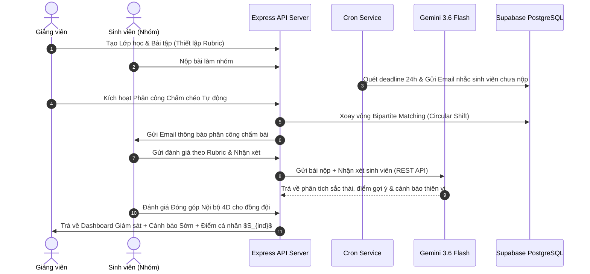

# PeerReview-AI — Chi Tiết Cơ Chế Vận Hành Kỹ Thuật (Đã Đối Chiếu Mã Nguồn)

Tài liệu này tổng hợp và giải thích chi tiết cơ chế hoạt động kỹ thuật, thuật toán, công thức toán học và logic xử lý dữ liệu được đối chiếu 100% trực tiếp từ **Mã nguồn Backend & Frontend** của hệ thống **PeerReview-AI**.

---

## 1. Cơ Chế Phân Công Chấm Chéo Tự Động (Automated Peer Review Assignment)
*Mã nguồn thực thi: `backend/src/services/review-assignment.service.js`*

### 🎯 Mục tiêu:
Phân công bài nộp của các nhóm/cá nhân cho các nhóm/cá nhân khác chấm chéo một cách công bằng, ngẫu nhiên, không trùng lặp và tuyệt đối không tự chấm bài của chính mình.

### ⚙️ Thuật toán & Logic kỹ thuật:
1. **Số bài chấm mặc định**:
   * Hằng số `REVIEWS_PER_GROUP = 2` (mỗi nhóm chấm đúng 2 bài nộp của nhóm khác).
2. **Sinh số ngẫu nhiên đinh hình (Deterministic PRNG & Mulberry32)**:
   * Chuyển `assignmentId` thành hạt giống số integer qua hàm `stringToSeed(assignmentId)`.
   * Sử dụng thuật toán **Mulberry32 PRNG** để tráo đổi ngẫu nhiên (Fisher-Yates Shuffle) danh sách nhóm bài nộp một cách cố định theo từng bài tập.
3. **Thuật toán Dịch chuyển Vòng tròn (Circular Shift Algorithm)**:
   * Với danh sách $n$ bài nộp ($n \ge 2$) và khoảng dịch $\text{shift} \in [1, \text{reviewsPerGroup}]$:
     $$\text{Reviewer}(i) \longrightarrow \text{Submission}\left((i + \text{shift}) \bmod n\right)$$
   * Đảm bảo tính chất: Nhóm $A$ không bao giờ tự chấm bài nhóm $A$, và không có 2 nhóm nào chấm trùng bài của nhau quá 1 lần.
4. **Bảo vệ Giao dịch & Khóa Tái phân công (Transaction & Invariant Guard)**:
   * Chạy trong DB Transaction với mức cô lập `REPEATABLE READ`.
   * Kiểm tra điều kiện tiên quyết: Nếu đã có bất kỳ đánh giá nào hoàn thành (`status = 'COMPLETED'`), hệ thống sẽ khóa chức năng phân công lại để bảo toàn dữ liệu điểm.

```mermaid
graph TD
    A[Giảng viên bấm Kích hoạt Phân công] --> B{Kiểm tra có Đánh giá đã hoàn thành?}
    B -- Có --> C[Báo lỗi 400: Đã có lượt chấm hoàn thành, không thể phân công lại]
    B -- Không --> D{Kiểm tra số lượng bài nộp >= 2?}
    D -- Không --> E[Báo lỗi 400: Chưa đủ bài nộp để chấm chéo]
    D -- Có --> F[Khởi tạo Mulberry32 PRNG từ hạt giống assignmentId]
    F --> G[Xoay vòng Circular Shift: (i + shift) % n]
    G --> H[Lưu vào DB bằng Transaction REPEATABLE READ]
```

---

## 2. Cơ Chế Trợ Lý Sư Phạm AI (Google Gemini Flash Engine)
*Mã nguồn thực thi: `backend/src/services/ai.service.js`*

### 🎯 Mục tiêu:
Hỗ trợ sinh viên và giảng viên phân tích nhận xét bài làm, chấm điểm theo Rubric, phát hiện thiên vị và gợi ý cải tiến sư phạm.

### ⚙️ Kiến trúc & Cơ chế Dự phòng Multi-Model:
1. **Danh sách Mô hình Đa tầng (Candidate Model Fallback Chain)**:
   * Cấu hình ưu tiên theo thứ tự: `GEMINI_MODEL` (nếu có) $\rightarrow$ `gemini-3.6-flash` $\rightarrow$ `gemini-3.5-flash-lite` $\rightarrow$ `gemini-3.5-flash` $\rightarrow$ `gemini-3.7-flash`.
   * Nếu mô hình chính hết Quota (lỗi HTTP `429`) hoặc không khả dụng (`404`), hệ thống tự động chuyển tiếp sang mô hình tiếp theo trong danh sách candidate mà không làm ngắt kết nối người dùng.
2. **Kỹ thuật System Instruction & Cấu hình JSON Output**:
   * Gửi payload REST API trực tiếp đến Google GenAI API endpoint với `responseMimeType: "application/json"` và `systemInstruction`.
3. **Cơ chế Bảo vệ & Xử lý Ngoại lệ (OOM Guard & Retry)**:
   * **AbortController Timeout**: Mặc định 5000ms.
   * **Exponential Backoff Retry**: Tự động thử lại tối đa 3 lần với thời gian chờ tăng dần (base delay 300ms).
   * **OOM Guard Limit**: Giới hạn phản hồi tối đa `1MB` (`1,048,576 bytes`), hủy phản hồi nếu vượt quá dung lượng để tránh tràn bộ nhớ Node.js.
   * **Parser An toàn (`extractJSON`)**: Tự động lọc bóc tách phần JSON hợp lệ khỏi các đoạn văn bản dư thừa, trả về `FALLBACK_RESPONSE` an toàn nếu AI phản hồi hỏng.

---

## 3. Cơ Chế Giám Sát & Cảnh Báo Sớm Rủi Ro Hợp Tác Nhóm (Early Warning System)
*Mã nguồn thực thi: `backend/src/services/analytics.service.js`*

### 🎯 Mục tiêu:
Tự động quét và phát hiện các rủi ro trong quá trình làm việc nhóm để cảnh báo cho Giảng viên trên Dashboard.

### ⚙️ Rule Engine 6 Quy Tắc Phát Hiện Rủi Ro:

| Mã Rủi Ro (`riskType`) | Tên Cảnh Báo | Mức Độ (`severity`) | Điều Kiện Kích Hoạt Trong Code |
| :--- | :--- | :--- | :--- |
| `DEAD_GROUP` | Nhóm không hoạt động | `HIGH` ($0.9$) | Nhóm tạo $> 2$ ngày nhưng tổng số log hoạt động $= 0$. |
| `LOW_ACTIVITY` | Cá nhân tương tác kém | `MEDIUM` ($0.6$) | Nhóm có $>5$ hoạt động nhưng 1 cá nhân có $0$ hoạt động. |
| `LOW_CONTRIBUTION` | Rủi ro Free-rider | `HIGH` ($0.9$) | Sinh viên có chỉ số `isFreeRider = true` ($C_{log} < 10\%$). |
| `UNBALANCED_CONTRIBUTION` | Phân chia việc mất cân bằng | `MEDIUM` ($0.6$) | 1 cá nhân đóng góp $> 80\%$ tổng điểm đóng góp của nhóm. |
| `INCOMPLETE_TASKS` | Rủi ro trễ deadline bài nộp | `HIGH` ($0.9$) | Thời gian tới deadline $\le 2$ ngày nhưng tỷ lệ hoàn thành task $< 30\%$. |
| `REVIEW_INACTIVITY` | Trễ hạn chấm chéo bài nộp | `HIGH` / `MEDIUM` | Đã hết hạn nộp bài: Tỷ lệ hoàn thành chấm chéo $= 0\%$ (`HIGH`) hoặc $< 50\%$ (`MEDIUM`). |

### 📐 Thuật toán Đánh giá Chất lượng Nhận xét & Thiên vị Chấm chéo (`getAssignmentReviewAnalytics`):
1. **Chỉ số Chất lượng Nhận xét ($Q_{review}$)**:
   $$Q_{review} = 0.4 \times \text{rubricScore} + 0.3 \times \text{feedbackScore} + 0.3 \times \text{varianceScore}$$
   * $\text{rubricScore}$: Tỷ lệ số tiêu chí được chấm trên tổng số tiêu chí Rubric.
   * $\text{feedbackScore}$: Chuẩn hóa độ dài và độ phong phú từ vựng của nhận xét ($\ge 20$ ký tự, $\ge 3$ từ độc lập).
   * $\text{varianceScore}$: Độ biến thiên điểm số giữa các tiêu chí (độ lệch chuẩn).
2. **Chỉ số Thiên vị / Xu hướng Chấm bài ($\text{biasScoreNormalized}$)**:
   $$\text{biasScoreNormalized} = \operatorname{Clamp}\left(-1, 1, \frac{\bar{S}_{given} - \bar{S}_{global}}{100}\right)$$
   * $\text{biasScoreNormalized} > 0.05 \longrightarrow$ **`isLenient`** (Cảnh báo chấm nương tay / dễ dãi).
   * $\text{biasScoreNormalized} < -0.05 \longrightarrow$ **`isHarsh`** (Cảnh báo chấm quá khắt khe).

---

## 4. Cơ Chế Tính Điểm Đóng Góp Cá Nhân Từ Nhật Ký Hoạt Động (Activity Contribution Engine)
*Mã nguồn thực thi: `backend/src/services/contribution.service.js` & `backend/src/constants/system.constants.js`*

### 📐 Trọng số Điểm Hoạt động (`CONTRIBUTION_WEIGHTS`):
* `SUBMISSION_CREATED`: **5 điểm** | `REVIEW_SUBMITTED`: **4 điểm** | `SUBMISSION_RESUBMITTED`: **3 điểm** | `TASK_COMPLETE`: **3 điểm**
* `SUBMISSION_LATE`: **2 điểm** | `CONTENT_EDITED`: **2 điểm** | `TASK_CREATE`: **1 điểm** | `TASK_UPDATE`: **1 điểm** | `DISCUSSION_POST`: **1 điểm** | `FILE_UPLOAD`: **1 điểm**

### 🛡️ Giới hạn Chống Spam (`CONTRIBUTION_CAPS`):
Áp dụng trần tối đa theo ngày để ngăn sinh viên spam tạo hành vi ảo:
* **Thảo luận bài viết**: Tối đa 5 bài/ngày.
* **Tải tệp tin**: Tối đa 5 tệp/ngày.
* **Tạo / Cập nhật Task**: Tối đa 10 lần/ngày.
* **Chỉnh sửa nội dung**: Tối đa 20 lần/ngày.

### 📐 Công thức Quy đổi Tương đối (Relative Normalization):
$$\text{scaleDenominator} = \max\left(\text{maxRawScore}, 20\right)$$
$$\text{finalScore} = \operatorname{Round}\left(\frac{\text{rawScore}}{\text{scaleDenominator}} \times 100\right)$$

### 🏷️ Phân loại Đóng góp:
* **`HIGH_CONTRIBUTOR`**: Điểm $\ge 80\%$ **VÀ** phải tham gia tối thiểu $\ge 2$ loại hoạt động khác nhau (ngăn chặn spam 1 loại duy nhất).
* **`NORMAL_CONTRIBUTOR`**: Điểm từ $50\% \rightarrow 79\%$.
* **`LOW_CONTRIBUTOR`**: Điểm từ $20\% \rightarrow 49\%$.
* **`FREE_RIDER`**: Điểm raw $< 5$ hoặc $0$ điểm.

---

## 5. Cơ Chế Đánh Giá Đóng Góp Nội Bộ Nhóm 4 Chiều & Biểu Đồ Radar (4D Group Peer Evaluation)
*Status: ⏳ [ĐANG TRONG KẾ HOẠCH TRIỂN KHAI - Mục 5.3]*

### 🎯 Mục tiêu:
Các thành viên trong cùng 1 nhóm tự đánh giá chéo lẫn nhau theo 4 chiều tiêu chuẩn để tính hệ số đóng góp $C_i$ và điểm cá nhân $S_{ind, i}$.

### 📐 4 Chiều & Trọng số Chuẩn:
1. **$d_1$: Khối lượng công việc (Workload Completion)**: $0\% - 100\%$ ($w_1 = 0.40$).
2. **$d_2$: Chất lượng sản phẩm/nhiệm vụ (Artifact Quality)**: Thang điểm 1 - 5 sao ($w_2 = 0.20$).
3. **$d_3$: Đúng hạn & Cam kết (Timeliness & Commitment)**: Thang điểm 1 - 5 sao ($w_3 = 0.20$).
4. **$d_4$: Phối hợp & Giúp đỡ đồng đội (Teamwork & Communication)**: Thang điểm 1 - 5 sao ($w_4 = 0.20$).

### 📐 Công thức Hệ số Đóng góp tổng hợp ($C_i$) & Điểm cá nhân ($S_{ind, i}$):
$$C_i = 0.40 \cdot \left(\frac{\bar{d}_{i, 1}}{100}\right) + 0.20 \cdot \left(\frac{\bar{d}_{i, 2}}{5}\right) + 0.20 \cdot \left(\frac{\bar{d}_{i, 3}}{5}\right) + 0.20 \cdot \left(\frac{\bar{d}_{i, 4}}{5}\right)$$
$$S_{ind, i} = \min\left(10.0, S_{group} \times C_i\right)$$

---

## 6. Cơ Chế Tự Động Gửi Email & Lịch Cron Nhắc Hạn (Deadline Cron Engine)
*Mã nguồn thực thi: `backend/src/services/cron-deadline.service.js` & `backend/src/services/email.service.js`*

### ⚙️ Vận hành & Bảo đảm Idempotency 100%:
1. **Lịch chạy Cron**: Thiết lập định kỳ mỗi giờ một lần (`0 * * * *`).
2. **Quét dữ liệu bài tập**: Tìm các bài tập có deadline trong vòng 24 giờ tới (`deadline BETWEEN NOW() AND NOW() + INTERVAL '24 HOURS'`).
3. **Bảng đánh dấu chống trùng lặp (`deadline_reminders_sent`)**:
   * Bảng DB có Unique Constraint: `UNIQUE(assignment_id, user_id, reminder_type)`.
   * Sử dụng câu lệnh `INSERT ... ON CONFLICT DO NOTHING RETURNING id`.
   * Email chỉ được gửi khi dòng mới được chèn thành công. Đảm bảo **tuyệt đối không bao giờ gửi trùng email nhắc nhở** cho cùng 1 sinh viên dù cron chạy nhiều lần.
4. **Cấu hình SMTP**: Nodemailer sử dụng cổng `587` với kết nối STARTTLS và thời hạn timeout `30,000ms`, tối ưu cho môi trường Render / Vercel Serverless.

---

## 7. Cơ Chế Bảo Mật, Xác Thực & Phân Quyền (Auth & Security Engine)
*Mã nguồn thực thi: `backend/src/services/auth.service.js` & `backend/src/middleware/auth.js`*

### ⚙️ Quy trình Bảo vệ 4 Lớp:
1. **Mã hóa mật khẩu**: Mã hóa Argon2 / bcrypt an toàn.
2. **Xác thực JWT Token**: Truyền ngầm qua `Authorization: Bearer <token>` mã hóa thông tin `userId`, `email`, `role`.
3. **Kiểm tra Trạng thái Khóa Tài Khoản (`is_locked`)**:
   * Mỗi request đến API đều kiểm tra cờ `is_locked`. Nếu tài khoản bị khóa, middleware lập tức chặn và trả về lỗi `403 Forbidden` cùng lý do khóa.
4. **Phân quyền theo Vai trò (RBAC Middleware)**:
   * Phân tách chặt chẽ quyền hạn của 3 vai trò: `ADMIN`, `TEACHER`, `STUDENT`. Giảng viên chỉ truy cập được dữ liệu thuộc các lớp học do chính mình phụ trách (`teacher_id = currentUser.userId`).

---

## 8. Sơ Đồ Trình Tự Tổng Thể (Sequence Diagram)


